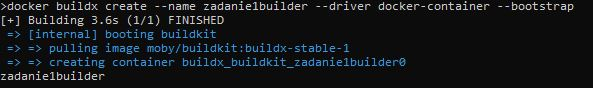
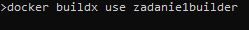
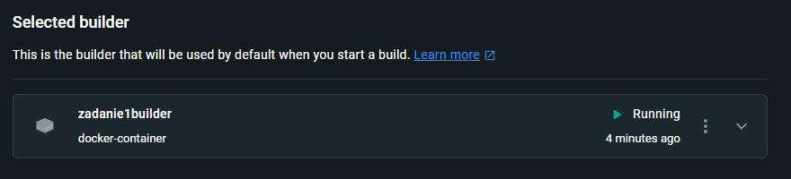
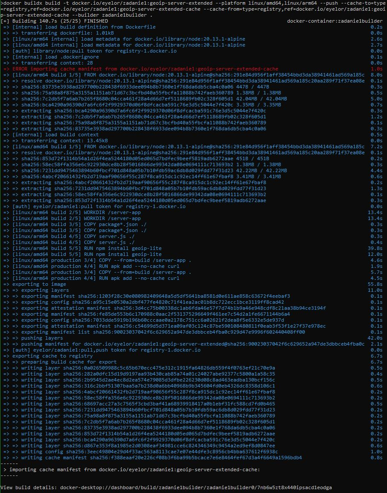
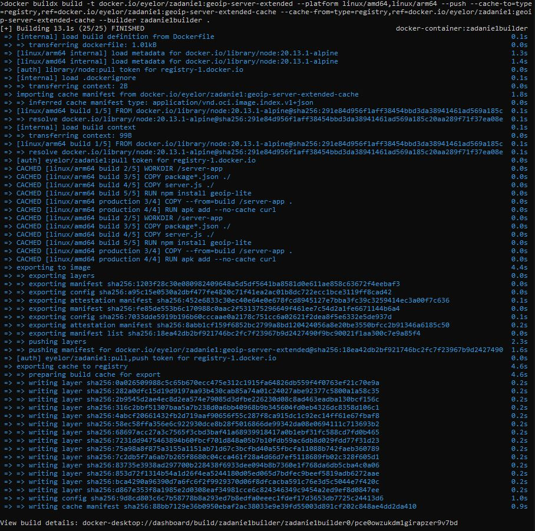

# docker-zadanie1-geoip-server-extended
This project showcases the process of building docker image with server side application which response with client's IP and time. Also uses buildix with custom builder to create image for many platforms at once while caching to different image.

## Table of Contents

- [Requirements](#requirements)
- [Image Building](#image-building)

## Requirements

For Linux and Windows systems Docker or Docker Desktop must be installed and running.

For Windows systems WSL must be installed.

Example for Windows:

To create a builder:

```cmd
docker buildx create --name zadanie1builder --driver docker-container --bootstrap
```

Result:



To use the created builder:

```cmd
docker buildx use zadanie1builder
```

Result:



To check if builder is selected as default open Docker Desktop > Settings > Builders.

Result:



## Image Building

Run the command below to build the image. Change the '-t' parameter value to your desired image repository  and tag on your account. Choose platforms you want. Set separate image for cache on your repository.

```cmd
docker buildx build -t docker.io/eyelor/zadanie1:geoip-server-extended --platform linux/amd64,linux/arm64 --push --cache-to=type=registry,ref=docker.io/eyelor/zadanie1:geoip-server-extended-cache --cache-from=type=registry,ref=docker.io/eyelor/zadanie1:geoip-server-extended-cache --builder zadanie1builder .
```

Result:



Run previous command again to see if cache was used.

Result:



Red ERROR dissapeared meaning that cache was used this time.

Link to these images: [hub.docker.com/r/eyelor/zadanie1/tags](https://hub.docker.com/r/eyelor/zadanie1/tags)

Documentation for server app and dockerfile here: [github.com/Eyelor/docker-zadanie1-geoip-server-basic/blob/main/zadanie1.md](https://github.com/Eyelor/docker-zadanie1-geoip-server-basic/blob/main/zadanie1.md)

